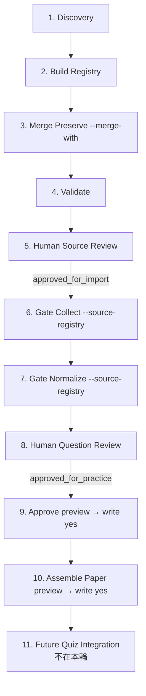

# Source-first Pipeline Reviewer Runbook（P3-10-P）

> 這份 runbook 把 **discovery → source registry → 來源審核 → gate collect → normalize → 題目審核 → approve → assemble paper** 整條操作流程整理成一份可照著跑的步驟手冊。
>
> 對應 P3-10-L / M / N / O 已落地的工具。本檔屬**操作指南**，不是規範文件；規則與硬邊界仍以 [`docs/SOURCE_REGISTRY_PLAN.md`](./SOURCE_REGISTRY_PLAN.md) 為準。
>
> 對象：reviewer / 維護者（家長 / 教師 / 整理人員）。寫作風格盡量避免工程黑話。
>
> 最新整理:2026-05-15（P3-10-P 第一版）。

---

## 0. 在開始之前

請先讀過：

- [`docs/SOURCE_REGISTRY_PLAN.md`](./SOURCE_REGISTRY_PLAN.md)：source-first 原則、7 種 sourceKind、4 種 reviewStatus、匯入規則 D-1 ~ D-6 硬邊界
- [`docs/PRACTICE_DATA_IMPORT_PLAN.md`](./PRACTICE_DATA_IMPORT_PLAN.md)：三層架構（Layer 0 source registry / Layer 1 resource index / Layer 2 imported source dataset / Layer 3 formal practice data）
- [`docs/CODEX_VALIDATION_RUNBOOK.md`](./CODEX_VALIDATION_RUNBOOK.md)：Codex 驗收手冊

幾個一定要先知道的關鍵字：

- `approved_for_import`（**來源層**）：reviewer 確認過該來源可以被下游 collector / normalizer 處理。**不**代表題目可以給小朋友練習。
- `approved_for_practice`（**題目層**）：reviewer 確認過該題目可以進正式題庫。**不**代表 `/quiz` 已經切到 imported 題庫。
- generated JSON：所有 `*.generated.json` / `*.preview.generated.json` 一律已被 `.gitignore` 排除；**絕不**`git add` 或 `git commit`。

---

## 1. 流程總覽

整條 source-first pipeline 共 11 步。每一步都可獨立重跑、可審計，且**只有來源層 + 題目層雙層審核都通過**之後，題目才會進正式題庫。

> **P3-10-Q 更新（2026-05-16）**：本流程總覽明確把 **validate source registry** 列為獨立的步驟 4（原本暗含在步驟 5 人工審核裡）；步驟 5 的「人工審核」與「標記 approved_for_import」合併描述為同一步，整體仍維持 11 步。每次 build / merge 後都應跑 validate 才能進人工審核；本檔第 2 段的步驟 4 已對應此操作。

```
[1]  搜尋 / discovery
       ↓ scripts/discover_resources.mjs
[2]  轉 source registry generated
       ↓ scripts/build_source_registry.mjs
[3]  (可選) merge preserve reviewer edits
       ↓ scripts/build_source_registry.mjs --merge-with
[4]  validate source registry          ← P3-10-Q：明確列出（每次 build / merge 後必跑）
       ↓ scripts/validate_source_registry.mjs
[5]  人工審核 source registry 並標記 approved_for_import
       ↓ reviewer 編輯 data/imported/source-registry.generated.json
       ↓ reviewer 確認 rights / publisher / partsCovered 後手動改 reviewStatus
[6]  用 source registry gate collect
       ↓ scripts/collect_discovered_resources.mjs --source-registry ...
[7]  用 source registry gate normalize
       ↓ scripts/normalize_collected_sources.mjs --source-registry ...
[8]  題目層 human review
       ↓ scripts/review_normalized_questions.mjs --mode prepare-review
       ↓ reviewer 編輯 reviewerFields，標 approved_for_practice
       ↓ scripts/review_normalized_questions.mjs --mode validate-reviewed
[9]  approved reviewed questions
       ↓ scripts/approve_reviewed_questions.mjs --mode preview （安全預覽）
       ↓ Codex 驗收 → reviewer 手動 --mode write --write yes（寫入正式題庫）
[10] assemble practice paper
       ↓ scripts/assemble_practice_paper.mjs --mode preview
       ↓ Codex 驗收 → reviewer 手動 --mode write --write yes
[11] 未來才接 /quiz（不在本輪、屬未來刀數）
```

> **離線 smoke check（P3-10-Q）**：執行 `npm run runbook:check` 可一鍵驗證上述 11 步的工具鏈仍與 runbook 命令對齊。Smoke 完全離線（不呼叫 Brave / OpenAI / 不對外抓取）、不修改正式題庫；通過只代表 CLI 仍正常、不代表來源 / 題目已通過審核。詳見本檔第 11 段。

### 一定要記住的雙層審核

- **來源層**（步驟 4–5）：reviewer 審核**來源網頁本身**是否可作為題目藍本；通過 → `reviewStatus = "approved_for_import"`。
- **題目層**（步驟 8）：reviewer 審核**從來源萃取出的題目草稿**是否可以給小朋友練習；通過 → `reviewStatus = "approved_for_practice"` + `reviewerFields.approvedForPractice = true`。

```
來源層 approved_for_import ≠ 題目層 approved_for_practice
題目層 approved_for_practice ≠ /quiz 已使用 imported 題庫
assemble paper 已寫 ≠ /quiz 已使用該 paper
```

### 不會自動發生的事

- `approved_for_import`：reviewer 必須**手動**改；本 pipeline 任何 CLI 都不會自動標。
- `approved_for_practice`：reviewer 必須**手動**改；CLI 不會自動標。
- 寫入正式題庫（`data/p3-example-questions.json` / `data/exam-papers.example.json`）:必須**雙開關**（`--mode write` + `--write yes`），缺一就 exit 2。
- `/quiz` 切換到 imported 題庫：**未來刀數**，本輪不做。

---

## 2. 每一步操作命令

> 所有命令請在 repo 根目錄執行。Node 版本需 ≥ 20（用了 `--env-file` 與 native fetch）。
>
> 預設參數請盡量保留（防呆很重要）；不要為了趕進度把 `--limit` 拉到很大或把 `--write yes` 當預設。

### 步驟 1：discovery — 找候選 URL

#### 1A. 用既有 example data 做離線 demo（推薦給第一次的人）

```bash
node scripts/discover_resources.mjs \
  --provider manual-json \
  --input data/imported/search-results.example.json \
  --queries data/imported/discovery-queries.example.json \
  --out data/imported/discovered-resources.generated.json
```

#### 1B. 真實 Brave Search（需要 API key；強烈建議第一次用最小 `--query-limit 1 --limit-per-query 1`）

> 先設定 `.env.local`：複製 `.env.example` 為 `.env.local`，把 `BRAVE_SEARCH_API_KEY` 填上。**`.env.local` 已被 `.gitignore` 排除，絕不 commit。**

```bash
node --env-file=.env.local scripts/discover_resources.mjs \
  --provider brave-search \
  --query-file data/imported/discovery-queries.example.json \
  --limit-per-query 1 \
  --query-limit 1 \
  --search-out data/imported/search-results.generated.json \
  --out data/imported/discovered-resources.generated.json
```

確認後再逐步把 `--query-limit` / `--limit-per-query` 拉大（注意 Brave API 額度）。

詳細 provider 比較與安全提示見 [`docs/DISCOVERY_CRAWLER_PLAN.md`](./DISCOVERY_CRAWLER_PLAN.md)。

---

### 步驟 2：轉 source registry generated JSON

```bash
node scripts/build_source_registry.mjs \
  --input data/imported/discovered-resources.generated.json \
  --out data/imported/source-registry.generated.json \
  --mode build \
  --limit 20
```

CLI 會：
- 對每筆 discovery entry 保守推論 `sourceKind` / `publisher` / `publisherType` / `partsCovered` / `fileType` / `language` / `level` / `exam`
- **絕不**自動標 `approved_for_import`
- 預設所有條目 `reviewStatus="pending_review"`；高風險（PDF / official / past_paper / unknown / score<5）升 `"needs_manual_check"`
- console summary 印 reviewStatus 與 sourceKind 統計

---

### 步驟 3：build + merge preserve（discovery 重跑時保護 reviewer 編輯）

> 第一次跑可跳過。reviewer 已開始審核之後再跑 discovery，**一定要用 `--merge-with`**，否則 reviewer 已標的 `approved_for_import` / `rightsNotes` / `partsCovered` 等會被覆蓋。

```bash
node scripts/build_source_registry.mjs \
  --input data/imported/discovered-resources.generated.json \
  --out data/imported/source-registry.generated.json \
  --mode build \
  --limit 20 \
  --merge-with data/imported/source-registry.generated.json
```

`--merge-with` 規則摘要：
- 命中既有條目（依 sourceUrl normalize）→ 保留 reviewer 編輯欄位
- 新 discovery 條目（無 match）→ 照原本規則產生 pending_review / needs_manual_check
- 既有條目在新 discovery 中找不到 → 保留為 orphan，**不刪、不降級** reviewStatus
- 新 entry 的 `src-gen-NNN` 編號自動避開既有 sourceId

詳細規則見 [`docs/SOURCE_REGISTRY_PLAN.md`](./SOURCE_REGISTRY_PLAN.md) E-bis-6 段。

---

### 步驟 4：validate source registry（每次 build / merge 後都要跑）

```bash
node scripts/validate_source_registry.mjs \
  --input data/imported/source-registry.generated.json
```

- 0 fail / 0 duplicateSourceIds → 可以進入步驟 5（reviewer 審核）
- 有 fail → **不要進下游**；先看錯誤訊息修正 source-registry.generated.json

---

### 步驟 5：reviewer 人工審核 source registry（**必須手動**）

打開 `data/imported/source-registry.generated.json`，**逐筆**審核（具體標準見本檔第 3 節）。

確認 OK 後**手動**把該條目改為：

```jsonc
{
  ...,
  "reviewStatus": "approved_for_import",
  "rightsNotes": "Reviewer confirmed usage boundary...",
  ...
}
```

審核完一輪後**再跑一次 validator**確認 schema 仍合法：

```bash
node scripts/validate_source_registry.mjs \
  --input data/imported/source-registry.generated.json
```

> **提醒**：reviewer 編輯後**不要 commit** `source-registry.generated.json`（檔案已被 `.gitignore` 排除）。reviewer 編輯結果由 `--merge-with` 在下次 discovery 重跑時保護。

---

### 步驟 6：用 source registry gate collect

```bash
node scripts/collect_discovered_resources.mjs \
  --input data/imported/discovered-resources.generated.json \
  --out data/imported/source-documents.batch.generated.json \
  --source-registry data/imported/source-registry.generated.json \
  --limit 5
```

- 只處理 `reviewStatus="approved_for_import"` 的 source URL；其他全部 skip + reason code
- 對 HTML 抓 cleanedText / headings / extractedCandidates
- 對 PDF / image / audio / video 只抓 HEAD metadata（不下載 binary、不解析 PDF）
- **正式匯入版必須提供 `--source-registry`**；不提供時 CLI 印 warning + 走 legacy / dev flow（不建議）

第一次跑強烈建議搭配 `--dry-run yes` 先看會處理哪些 URL：

```bash
node scripts/collect_discovered_resources.mjs ... --dry-run yes
```

---

### 步驟 7：用 source registry gate normalize

```bash
node scripts/normalize_collected_sources.mjs \
  --input data/imported/source-documents.batch.generated.json \
  --out data/imported/normalized-questions.generated.json \
  --source-registry data/imported/source-registry.generated.json \
  --mode rule-based \
  --limit 10
```

- 只 normalize 來源已 `approved_for_import` 的 source_document
- rule-based v0.1 保守邊界：**不猜 answer / options**（draft.answer=null / options=[]，留給 reviewer 手補）
- 所有 draft 一律 `reviewStatus="needs_human_review"` + `isReadyForPractice=false`
- 不從 PDF / asset / resource_index 產題（避免 third-party 內容污染）

---

### 步驟 8：題目層 human review

#### 8A. prepare-review：把 draft 轉成 reviewer 工作介面

```bash
node scripts/review_normalized_questions.mjs \
  --input data/imported/normalized-questions.generated.json \
  --out data/imported/reviewed-questions.generated.json \
  --mode prepare-review \
  --limit 10
```

如果 `--out` 已存在（reviewer 之前已開始編輯），用 `--merge-with` 保留現有 reviewerFields：

```bash
node scripts/review_normalized_questions.mjs \
  --input data/imported/normalized-questions.generated.json \
  --out data/imported/reviewed-questions.generated.json \
  --mode prepare-review \
  --limit 10 \
  --merge-with data/imported/reviewed-questions.generated.json
```

或明確覆寫（**請確認你不會丟失 reviewer 工作**）：`--overwrite yes`

#### 8B. reviewer 編輯 `reviewed-questions.generated.json`

reviewer 對每筆 reviewerFields 補：
- `finalQuestion`（含 id / type / prompt / answer / options / starterPart 等）
- 通過 → 把該筆 `reviewStatus` 改 `"approved_for_practice"`、`reviewerFields.approved=true`、`reviewerFields.approvedForPractice=true`
- 不通過 → `reviewStatus="rejected"` 或保留 `"human_review_required"` 等待修正

#### 8C. validate-reviewed：驗證 reviewer 編輯結果

```bash
node scripts/review_normalized_questions.mjs \
  --input data/imported/reviewed-questions.generated.json \
  --mode validate-reviewed
```

- 寫 `data/imported/review-validation.generated.json`
- 對 reviewer 標 `approvedForPractice=true` 的條目跑 schema 驗證（type / starterPart / answer 一致性 / true-false yes/no / CHOICE_TYPES options ≥ 2 + answer 在 options 內）

---

### 步驟 9：approved reviewed questions（**雙開關保護正式題庫**）

#### 9A. preview（預設、絕對安全）

```bash
node scripts/approve_reviewed_questions.mjs \
  --reviewed data/imported/reviewed-questions.generated.json \
  --validation data/imported/review-validation.generated.json \
  --target data/p3-example-questions.json \
  --out data/imported/approved-questions.preview.generated.json \
  --mode preview \
  --limit 10
```

- preview mode **絕對不動正式題庫**；只寫 preview JSON
- 5-AND 篩選：validate-reviewed `passed` + reviewed `approved_for_practice` + `approved=true` + `approvedForPractice=true` + `finalQuestion` 存在
- duplicate id（target 既有 / 同批內）→ 標 warning（preview 仍寫，write mode 整批拒絕）

#### 9B. write（**請先讓 Codex 驗收 preview JSON 後再跑**）

```bash
node scripts/approve_reviewed_questions.mjs \
  --reviewed data/imported/reviewed-questions.generated.json \
  --validation data/imported/review-validation.generated.json \
  --target data/p3-example-questions.json \
  --out data/imported/approved-questions.preview.generated.json \
  --mode write --write yes \
  --limit 10
```

- 必須同時 `--mode write` + `--write yes`，缺一就 exit 2
- 任一 duplicate id 觸發 → 整批拒絕 exit 2 + preview JSON 仍寫
- **reviewer 寫完後**自行 `git diff data/p3-example-questions.json` 確認後再 commit
- 這是**正式題庫變更**——commit 訊息建議寫明來源 sourceId + reviewer 名字 + 來源 URL

---

### 步驟 10：assemble practice paper（**同樣雙開關**）

#### 10A. preview

```bash
node scripts/assemble_practice_paper.mjs \
  --questions data/p3-example-questions.json \
  --papers data/exam-papers.example.json \
  --out data/imported/practice-paper.preview.generated.json \
  --mode preview \
  --paper-id starters-practice-paper-001 \
  --limit 20
```

- preview mode 絕對不動正式 papers 檔
- 自動依 `starterSection` 分組成 listening / reading-writing / speaking
- sourceMix 由 question.source 統計（official_sample / past_paper / ai_generated / custom）
- 對 9 個 Cambridge Starters Parts 缺少時標 `insufficient_questions_for_part` warning
- duplicate paper-id → preview 標 warning；write mode 整批拒絕 exit 2

#### 10B. write（**Codex 驗收 preview 後再跑**）

```bash
node scripts/assemble_practice_paper.mjs \
  --questions data/p3-example-questions.json \
  --papers data/exam-papers.example.json \
  --out data/imported/practice-paper.preview.generated.json \
  --mode write --write yes \
  --paper-id starters-practice-paper-001 \
  --limit 20
```

- 必須同時 `--mode write` + `--write yes`
- 寫完後 `git diff data/exam-papers.example.json` 確認後再 commit

---

### 步驟 11：未來才接 `/quiz`

**本輪不做**。`lib/data.ts` 的 quiz 載入邏輯仍跑既有 13 題範例。`/quiz` 整合到 imported 題庫屬未來刀數。

當 reviewer 寫了第一份完整的正式 paper 後，仍須等：
- Codex 驗收 paper 與題庫
- `/quiz` 切換載入邏輯
- UI 區分「imported 題目」與「example seed 題目」

這些都屬未來範圍；本 runbook 不涵蓋。

---

## 3. Reviewer 人工審核 source registry 指南（步驟 5 詳解）

> reviewer 開啟 `data/imported/source-registry.generated.json` 後，**逐筆**對下列 7 個面向確認。**任何一項沒過都不能改 reviewStatus=approved_for_import**。

### 3-1. sourceUrl 是否真的可追溯

- 點開 URL，確認頁面**真的存在**且**真的有 Starters 相關內容**
- discovery title / snippet 可能誤導；要看實際頁面內容
- URL 是否需要登入 / 是否是付費牆？若是 → 標 `accessType` 為 `free_with_signup` / `paid` 並考慮拒絕

### 3-2. publisher / publisherType 是否正確

- **`publisherType="official"` 只能用於真正的官方網域**（cambridgeenglish.org / cambridge.org）
- 看起來像 Cambridge 但網域不對（例如 `fake-cambridge.example`）→ **絕對**不是 official，要降為 `third_party`
- YLE 台灣（yle.tw）/ Certificate 台灣（certificate.tw）等本地代理 → `publisherType="school"`，**仍需** `needs_manual_check` 直到 reviewer 親自看過
- 教師個人部落格 → `publisherType="teacher"`
- 不確定 → `publisherType="unknown"`，**絕不**進 `approved_for_import`

### 3-3. sourceKind 是否正確

- **`official_sample`** / **`past_paper`** 只能搭配 `publisherType ∈ { official, school }`（[`docs/SOURCE_REGISTRY_PLAN.md`](./SOURCE_REGISTRY_PLAN.md) D-4）
- 第三方練習網站宣稱「歷屆考題」？→ **仍是** `third_party_practice`，**不可**升 `past_paper`
- shopping / 賣場頁面 → `unknown`（build CLI 已自動標）
- 不確定 → 保留 `unknown` 或 `needs_manual_check`

### 3-4. partsCovered 是否正確

- 預設多半是 `["unknown"]`（discovery 沒抓到具體 part）
- reviewer 翻看頁面後可改為 `["L3"]` / `["RW3", "RW4"]` 等
- **不要亂猜**；找不到明確線索就保留 `["unknown"]`
- 合法值：L1 / L2 / L3 / L4 / RW1 / RW2 / RW3 / RW4 / RW5 / SP1 / SP2 / SP3 / SP4 / unknown

### 3-5. rightsNotes 是否確認使用邊界

- 預設文字是 `"Not reviewed. Do not import until reviewer confirms usage boundary..."`
- reviewer 必須**親自**確認該頁面的著作權 / 使用條款 / 是否可作為自家練習藍本
- 確認後改為具體文字，例如 `"Reviewer confirmed usage boundary on 2026-05-15; source page allows personal educational use; reformulation only, no direct copy."`
- **絕不**寫「已取得授權」這種沒驗證過的話

### 3-6. provenanceNotes 是否足夠

- 預設文字記錄 discovery id 與 source query
- reviewer 可補：哪一輪 discovery 找到的 / 為什麼選這個來源 / 與其他來源的關係
- 例：`"Generated from disc-001 (2026-05-15 brave-search); reviewer verified PDF download is the official Cambridge sample paper vol1 2018."`

### 3-7. 是否真的確定才改 approved_for_import

最後一道閘：reviewer 確認上述 6 項都過了，才**手動**把 `reviewStatus` 從 `"pending_review"` / `"needs_manual_check"` 改為 `"approved_for_import"`。

### 紅線（任何一條違反 → **絕不可**改為 approved_for_import）

- ❌ 不可因為「看起來像 Cambridge」就 approved（網域不對 = 假冒）
- ❌ 不可把 `third_party_practice` 偽裝成 `official_sample` / `past_paper`
- ❌ `sourceKind="unknown"` 或 `publisherType="unknown"` 不可直接進下游
- ❌ `approved_for_import` 只表示「來源可進下游」，**不**表示「題目已可練習」
- ❌ 不可為了趕進度 batch approve；每筆都要逐筆人工確認

---

## 4. Reviewer 編輯範例（before / after）

下列是一筆 build_source_registry.mjs 自動產出的 entry，reviewer 親自看過來源頁面後手動編輯。

### Before（build CLI 自動產出）

```jsonc
{
  "sourceId": "src-gen-003",
  "title": "RW3 Starters spelling worksheet — Look at the picture, write the word",
  "sourceKind": "third_party_practice",
  "sourceUrl": "https://example-worksheet.com/starters/rw3-spelling.html",
  "publisher": "example-worksheet.com",
  "publisherType": "third_party",
  "language": "en",
  "level": "Pre A1 Starters",
  "exam": "Cambridge Starters",
  "partsCovered": ["RW3"],
  "fileType": "html",
  "accessType": "unknown",
  "collectionStatus": "discovered",
  "reviewStatus": "pending_review",
  "provenanceNotes": "Generated from discovery output (disc id: disc-003, source query: Starters spelling worksheet); reviewer must verify source kind, publisher, parts covered, and rights before import.",
  "rightsNotes": "Not reviewed. Do not import until reviewer confirms usage boundary, license, and copyright. Auto-generated entry — never approve without manual verification.",
  "collectedAt": null,
  "lastCheckedAt": null
}
```

### After（reviewer 親自審核並編輯）

```jsonc
{
  "sourceId": "src-gen-003",
  "title": "RW3 Starters spelling worksheet — Look at the picture, write the word",
  "sourceKind": "third_party_practice",
  "sourceUrl": "https://example-worksheet.com/starters/rw3-spelling.html",
  "publisher": "example-worksheet.com",
  "publisherType": "third_party",
  "language": "en",
  "level": "Pre A1 Starters",
  "exam": "Cambridge Starters",
  "partsCovered": ["RW3"],
  "fileType": "html",
  "accessType": "public",
  "collectionStatus": "discovered",
  "reviewStatus": "approved_for_import",
  "provenanceNotes": "Reviewer verified 2026-05-15: page lists 10 picture+word prompts in Starters RW3 format; not an exact replica of any official Cambridge sample paper item.",
  "rightsNotes": "Reviewer confirmed usage boundary 2026-05-15: site terms allow personal educational use; we will reformulate (not copy) any item used as a draft seed.",
  "collectedAt": null,
  "lastCheckedAt": "2026-05-15T00:00:00.000Z"
}
```

### 變動點對照

| 欄位 | 變化 | 意義 |
| --- | --- | --- |
| `accessType` | `unknown` → `public` | reviewer 確認頁面公開可瀏覽 |
| `reviewStatus` | `pending_review` → `approved_for_import` | 來源層通過、可進下游 |
| `provenanceNotes` | 預設模板 → 具體說明 | reviewer 記錄審核日期與觀察 |
| `rightsNotes` | 預設「未審核」 → 具體授權說明 | 留下決策依據供日後追溯 |
| `lastCheckedAt` | `null` → ISO 8601 | 留 timestamp |
| 其他欄位 | 不變 | discovery 自動推論已經正確 |

### 一定不能做

- ❌ 不要在 `rightsNotes` 寫「已取得官方授權」（除非真的有書面授權）
- ❌ 不要把 `sourceKind` 從 `third_party_practice` 升為 `official_sample` / `past_paper`（網域不對）
- ❌ 不要把 `publisherType` 從 `third_party` 升為 `official`（網域不對）
- ❌ 不要在 runbook 範例 / 提交檔案中放任何真實 API key

---

## 5. 常見安全提醒（不可 commit / 可 commit 清單）

### 5-1. **絕不可** commit 的檔案

下列檔案 / 路徑已在 `.gitignore` 排除；**任何情況下**都不要 `git add`：

```
# 密鑰 / 環境
.env
.env.local
.env.development.local
.env.production.local
.claude/settings.local.json

# discovery / build / collector / normalize / review / approve / paper 的 generated artifacts
data/imported/search-results.generated.json
data/imported/discovered-resources.generated.json
data/imported/resource-index.generated.json
data/imported/source-document.generated.json
data/imported/source-documents.batch.generated.json
data/imported/normalized-questions.generated.json
data/imported/reviewed-questions.generated.json
data/imported/review-validation.generated.json
data/imported/approved-questions.preview.generated.json
data/imported/practice-paper.preview.generated.json
data/imported/source-registry.generated.json
```

如果不小心 `git add` 進去了，**立刻** `git restore --staged <path>` 撤回；commit 前一定要 `git status` 檢查。

### 5-2. **可** commit 的 example data

下列檔案是專案範例，**可以** commit / 可以追蹤：

- `data/imported/source-registry.example.json`
- `data/imported/discovered-resources.example.json`
- `data/imported/search-results.example.json`
- `data/imported/discovery-queries.example.json`
- `data/imported/resource-index.example.json`
- `data/imported/source-document.example.json`
- `data/imported/normalized-questions.example.json`

**重要**：example data 是範例，**不**代表已通過審核；任何 `reviewStatus="approved_for_import"` / `"approved_for_practice"` 字樣若出現在 example data，都只是格式說明、不是事實。

### 5-3. 寫入正式題庫的安全 checklist

`scripts/approve_reviewed_questions.mjs --mode write --write yes` 與 `scripts/assemble_practice_paper.mjs --mode write --write yes` 會修改 `data/p3-example-questions.json` / `data/exam-papers.example.json`。寫入前請逐項確認：

1. ✅ 已先跑過對應 preview mode 並看過 preview JSON
2. ✅ preview summary 顯示的 `readyToAppend` / `duplicateIds` / `warnings` 都符合預期
3. ✅ Codex 已驗收 preview JSON
4. ✅ reviewer 親自確認 `data/imported/approved-questions.preview.generated.json` 內容
5. ✅ 寫完後 **立刻** `git diff data/p3-example-questions.json` 比對
6. ✅ 確認沒有非預期的題目被加入 / 既有題目被改動
7. ✅ commit 訊息寫明：來源 sourceId / reviewer 名字 / 來源 URL / 審核日期

---

## 6. 常見錯誤與處理（troubleshooting）

### 6-1. `validate_source_registry.mjs` failed

**症狀**：跑 validator 後 `failed=N > 0` 或 `duplicateSourceIds > 0`，exit 1。

**處理**：
- 看每筆 `[FAIL]` 下方列出的錯誤碼（例如 `field_must_be_non_empty_string:publisher` / `invalid_enum_sourceKind:foo` / `duplicate_sourceId:src-x`）
- 直接修 `data/imported/source-registry.generated.json` 對應條目
- duplicate sourceId：保留正確的那筆、刪掉重複的；或下次用 `--merge-with` 重 build 讓 sourceId 自動避讓
- **不要進下游**直到 validator 0 fail

### 6-2. duplicate sourceId

**症狀**：validator 印 `duplicate_sourceId:src-gen-003`；或 build_source_registry 跑 `--merge-with` 時 exit 2 提示「--merge-with 含 duplicate sourceId」。

**處理**：
- existing registry 含 dup → reviewer 手動把其中一筆改 sourceId（或刪除）後再 build
- 重 build：用 `--merge-with` 模式，CLI 會自動避開既有 sourceId 配發新 id
- 確認後再跑 validator

### 6-3. collect 全部 skipped

**症狀**：跑 `collect_discovered_resources.mjs` 時 console 印 `collected=0 skipped=N`，所有條目都 skip。

**處理**：
1. 看 `summary.sourceRegistry`：
   - `approvedSources=0` → 沒有任何來源被 reviewer 標為 `approved_for_import`；需先完成步驟 5
   - `skippedNotInSourceRegistry=N` → discovery URL 不在 registry；可能 registry 還沒 build 或 build 後 reviewer 改了 sourceUrl
   - `skippedSourceNotApprovedForImport=N` → URL 在 registry 但 reviewStatus 不是 approved；reviewer 仍需審核
2. 確認 `--source-registry` 路徑正確
3. 用 `--dry-run yes` 重跑看 gate 判定

### 6-4. normalize 沒有 draft

**症狀**：跑 `normalize_collected_sources.mjs` 後 `drafts=0`。

**處理**：
- `summary.eligible=0`：上游 collect 全部 skip 或 source registry gate 擋掉；先處理 6-3
- `summary.eligible>0 drafts=0 observations=N`：source_document 有內容但 collector 沒抓到 candidates；reviewer 可手動編輯 source-document JSON 補 candidate（屬進階流程）
- `skipped_no_cleaned_text`：來源頁面可能是 SPA / JS 渲染，collector 抓不到內容；屬未來改善範圍

### 6-5. approvedSources=0

**症狀**：collect / normalize 的 `summary.sourceRegistry.approvedSources=0`。

**處理**：
- 開啟 `data/imported/source-registry.generated.json`
- 確認**至少**一筆 `reviewStatus="approved_for_import"`
- 若一筆都沒有：完成步驟 5 reviewer 審核後再回頭跑

### 6-6. source URL 不匹配 / gate 不通過

**症狀**：某筆 URL 應該通過 gate 但被 skip，warning 顯示 `skipped_not_in_source_registry` 或 `skipped_source_not_approved_for_import`。

可能原因：

| 情境 | 處理 |
| --- | --- |
| URL 大小寫不同（host 大小寫） | URL gate 已自動 lowercase host；通常不是問題 |
| URL 尾斜線差異（`/path` vs `/path/`） | gate 已自動 strip trailing slash（pathname=`/` 除外）；不影響 |
| URL 帶 fragment（`#section`） | gate 自動移除 fragment；不影響 |
| URL 帶 query string（`?id=123`） | gate **保留** search；registry 與 discovery 兩邊 query 必須完全一致 |
| URL 改了 protocol（http vs https） | gate 把 http / https 視為不同；統一兩邊 |
| reviewer 改了 registry 的 sourceUrl | 改回原 URL，或用 fallback merge key（title + raw URL） |

詳細 normalization 規則見 [`docs/SOURCE_REGISTRY_PLAN.md`](./SOURCE_REGISTRY_PLAN.md) E-bis-5 段。

### 6-7. merge-with 檔案不是 array / parse 失敗

**症狀**：`build_source_registry.mjs --merge-with` exit 2。

**處理**：
- 看錯誤訊息（例：`--merge-with JSON 必須是最外層陣列：<path>（讀到 object）`）
- 確認 `--merge-with` 指向的是 array JSON（最外層 `[ ... ]`）
- 如果是 build_source_registry 自己的舊 output，理論上一定是 array；除非檔案損壞或被別的工具改過

### 6-8. reviewer edits 被覆蓋

**症狀**：reviewer 已標 `approved_for_import` 等欄位，但下次 build 後消失。

**預防**：
- discovery 重跑後**一定要用 `--merge-with`**：
  ```bash
  node scripts/build_source_registry.mjs ... --merge-with data/imported/source-registry.generated.json
  ```
- 沒用 `--merge-with` → 覆寫模式 → reviewer 編輯會全部洗掉
- 同樣的，題目層的 `review_normalized_questions.mjs --mode prepare-review` 也支援 `--merge-with`；reviewer 已開始編輯 reviewed-questions.generated.json 後重跑 prepare-review 一定要帶 `--merge-with`

### 6-9. 沒提供 `--source-registry` 是 legacy / dev flow

**症狀**：collect / normalize 跑完印 warning「source-first gate 未啟用」。

**處理**：
- 這只是 warning 不是錯誤；CLI 仍會跑完
- **正式匯入版必須提供 `--source-registry`**；dev / legacy / 第一次測試可以不提供
- 若這是正式 run → 補上 `--source-registry data/imported/source-registry.generated.json` 重跑

### 6-10. source approved 但題目仍需 human review

這**不是錯誤**，是設計：

- `approved_for_import`（來源層）= reviewer 確認來源網頁本身可作為題目藍本
- `approved_for_practice`（題目層）= reviewer 確認萃取出的題目本身可給小朋友練習

兩者**獨立**。即使來源 approved，每一道題目仍必須走步驟 8 reviewer 編輯 + 步驟 9 approve。

---

## 7. 本階段不要做

> 下列事項屬未來範圍或硬邊界；reviewer / 開發者**現在**都不該做。

- ❌ **不要直接切 `/quiz` 使用 imported 題庫**：`/quiz` 整合屬未來刀數，需要 UI 區分 imported / example seed、需要 `lib/data.ts` 載入邏輯擴充、需要 Codex 多輪驗收
- ❌ **不要把 `ai_generated` 題補進正式題庫**：P3-10-L source-first 原則禁止；`ai_generated` 屬「正式題庫完成後的延伸練習」、不能補正式題庫數量
- ❌ **不要跳過 source registry**：直接跑 collect / normalize 不接 `--source-registry` 是 legacy / dev flow，**不是**正式匯入流程
- ❌ **不要跳過題目 human review**：normalize 出的 draft 一律 `needs_human_review`；reviewer 不簽 `approved_for_practice` 就不能進 approve_reviewed_questions
- ❌ **不要直接 write 到 `data/p3-example-questions.json`**：必須先 preview → Codex 驗收 → reviewer 手動雙開關（`--mode write --write yes`）
- ❌ **不要 commit 任何 generated JSON**：詳見本檔第 5 節
- ❌ **不要把 `approved_for_import` 當成 `approved_for_practice`**：兩個層級、兩個審核、不能混淆
- ❌ **不要為了趕進度 batch approve**：每筆都要逐筆人工審核（來源層 + 題目層皆是）
- ❌ **不要繞過 Codex 驗收**：寫入正式題庫前 preview JSON 必須由 Codex 驗收
- ❌ **不要在文件 / 範例 / commit 中放真實 API key**：API key 只放 `.env.local`（已 .gitignore）

---

## 8. 流程圖

### ASCII 全景

```
+--------------------+
|   1. discovery     |  discover_resources.mjs (manual-json / brave-search)
+--------------------+
          │  data/imported/discovered-resources.generated.json
          ▼
+--------------------+
|   2. build         |  build_source_registry.mjs
|   registry         |
+--------------------+
          │  data/imported/source-registry.generated.json
          ▼  (重跑 discovery 時請加 --merge-with → 步驟 3)
+--------------------+
|   3. merge         |  build_source_registry.mjs --merge-with <existing>
|   preserve         |
+--------------------+
          │
          ▼
+--------------------+
|   4. validate      |  validate_source_registry.mjs
+--------------------+
          │  0 fail → 進步驟 5
          ▼
+--------------------+
|   5. 人工審核       |  reviewer 開 source-registry.generated.json 逐筆審
|   source registry   |
+--------------------+
          │  確認 OK
          ▼
+--------------------+
|   ★ approved_      |  reviewer 手動改 reviewStatus="approved_for_import"
|   for_import        |  + rightsNotes + provenanceNotes
+--------------------+
          │
          ▼
+--------------------+
|   6. gate collect  |  collect_discovered_resources.mjs --source-registry ...
+--------------------+
          │  data/imported/source-documents.batch.generated.json
          ▼
+--------------------+
|   7. gate          |  normalize_collected_sources.mjs --source-registry ...
|   normalize        |
+--------------------+
          │  data/imported/normalized-questions.generated.json
          ▼
+--------------------+
|   8. 題目層審核     |  review_normalized_questions.mjs
|                    |  --mode prepare-review → 編輯 → --mode validate-reviewed
+--------------------+
          │  data/imported/reviewed-questions.generated.json
          │  data/imported/review-validation.generated.json
          ▼
+--------------------+
|   ★ approved_      |  reviewer 手動標 reviewStatus="approved_for_practice"
|   for_practice      |  + reviewerFields.approvedForPractice=true
+--------------------+
          │
          ▼
+--------------------+
|   9. approve       |  approve_reviewed_questions.mjs --mode preview
|   reviewed         |  → Codex 驗收 → --mode write --write yes
+--------------------+
          │  data/p3-example-questions.json （正式題庫，commit）
          ▼
+--------------------+
|  10. assemble      |  assemble_practice_paper.mjs --mode preview
|  paper             |  → Codex 驗收 → --mode write --write yes
+--------------------+
          │  data/exam-papers.example.json （正式 papers，commit）
          ▼
+----------------------------+
|  11. /quiz 整合（未來刀數） |  屬未來範圍；本輪不做
+----------------------------+
```

### Mermaid 版（可在支援 Mermaid 的 Markdown viewer 中渲染）



---

## 9. 文件索引（與其他文件的關係）

| 文件 | 角色 |
| --- | --- |
| [`docs/SOURCE_REGISTRY_PLAN.md`](./SOURCE_REGISTRY_PLAN.md) | **規範文件**：source-first 原則 / 7 種 sourceKind / 4 種 reviewStatus / 匯入規則硬邊界 / 4 個工具（build / validate / merge / gate）的設計 |
| [`docs/PRACTICE_DATA_PLAN.md`](./PRACTICE_DATA_PLAN.md) | **umbrella**：P3-10 正式練習資料補齊規劃 / 「最小可玩」題量目標 |
| [`docs/PRACTICE_DATA_IMPORT_PLAN.md`](./PRACTICE_DATA_IMPORT_PLAN.md) | **三層架構**：Layer 0 source registry / Layer 1 resource index / Layer 2 imported source dataset / Layer 3 formal practice data；7 種 sourceType 字面量 |
| [`docs/DISCOVERY_CRAWLER_PLAN.md`](./DISCOVERY_CRAWLER_PLAN.md) | discovery crawler 規範與 provider 選擇 |
| [`docs/WEB_RESOURCE_COLLECTOR_PLAN.md`](./WEB_RESOURCE_COLLECTOR_PLAN.md) | collector 模式（index-only / full-text / asset-aware） |
| [`docs/QUESTION_IMPORT_NORMALIZATION_PLAN.md`](./QUESTION_IMPORT_NORMALIZATION_PLAN.md) | normalizer / review / approve workflow 規範 |
| [`docs/CODEX_VALIDATION_RUNBOOK.md`](./CODEX_VALIDATION_RUNBOOK.md) | Codex 驗收程序（preview 寫入正式題庫前必跑） |
| [`docs/TASK_ROUTER.md`](./TASK_ROUTER.md) | Claude Code / Codex / ChatGPT 三邊分工 |
| [`docs/OFFICIAL_RESOURCES.md`](./OFFICIAL_RESOURCES.md) | 官方資源人工瀏覽邊界（不下載、不複製） |
| [`PROJECT_ROADMAP.md`](../PROJECT_ROADMAP.md) | P3-10 階段進度 |

本檔（`SOURCE_FIRST_PIPELINE_RUNBOOK.md`）的定位是 **操作手冊**——把上述規範文件串成一條 reviewer 可實際照著跑的流程；遇規則衝突時以**規範文件**為準。

---

## 10. 離線 smoke check：`npm run runbook:check`（P3-10-Q / P3-10-R）

> P3-10-Q 落地的離線一鍵 smoke check + P3-10-R 把它延伸到後半段 preview pipeline：用來確認 runbook 命令與目前 CLI flags 仍對齊、整條工具鏈（含 review / approve / assemble preview）沒有 regression。**完全不對外抓取**、**完全不修改正式題庫**、**approve / assemble 一律只跑 preview**（不會 `--mode write` / `--write yes`）。

### 10-1. 用法

```bash
npm run runbook:check
# 或：
node scripts/runbook_smoke_check.mjs
```

Exit code：0 = 全部 PASS / 1 = 任一檢查失敗。

### 10-2. Smoke 做了哪些事

| 階段 | 內容 |
| --- | --- |
| 1 | 9 個 CLI 的 `--help` 都跑過 + 每個 exit 0 |
| 2 | 用 `data/imported/discovered-resources.example.json` 跑 `build_source_registry.mjs` → 寫到 `os.tmpdir()` |
| 3 | 對上一步輸出跑 `validate_source_registry.mjs`（須 PASS） |
| 4 | 對同一份 example discovery 跑 `build_source_registry.mjs --merge-with`（測試 merge / preserve） |
| 5 | 對 merged registry 再跑 validator（須 PASS） |
| 6 | `collect_discovered_resources.mjs --source-registry ... --dry-run yes` 跑 example（0 approved 可接受，只要不 crash） |
| 7 | 在 `/tmp` 自建 fixture：discovery 1 筆 + registry 1 筆 `approved_for_import` → collect dry-run 預期 `approvedSources=1, dryRun=1` |
| 8 | 在 `/tmp` 自建 fixture：3 筆 source_document（approved / pending / not-in-registry）+ 對應 registry → normalize 預期 `drafts=1, skipped>=2` |
| 9 | 把 step 8 的 normalize output 餵 `review_normalized_questions.mjs --mode prepare-review` → 預期 `queued>=1`（**P3-10-R**） |
| 10 | 在 smoke script 內 fake-approve 第一筆 review item（**fixture 標 reviewer 已審核**：reviewStatus=approved_for_practice / reviewerFields.approved=true / approvedForPractice=true / finalQuestion 完整）→ 跑 `validate-reviewed` → 預期 `passedValidation>=1` + `failedValidation=0`（**P3-10-R**） |
| 11 | 把 fake-approved reviewed + validation 餵 `approve_reviewed_questions.mjs --mode preview --target <empty array>` → 預期 `readyToAppend>=1` + target hash stable（**P3-10-R**） |
| 12 | 用最小 ExamQuestion fixture（1 筆 spelling RW3）餵 `assemble_practice_paper.mjs --mode preview --paper-id smoke-paper-001 --papers <empty array>` → 預期 `examPaperId=smoke-paper-001` + `sections>=1` + papers hash stable（**P3-10-R**） |

### 10-3. 安全保證

- ❌ **不**呼叫 Brave Search / OpenAI / 任何雲端 API
- ❌ **不**對外發 HTTP / HEAD 請求
- ❌ **不**下載 PDF / image / audio
- ❌ **不**解析 PDF
- ❌ **不**修改 `data/p3-example-questions.json` / `data/exam-papers.example.json`（每次跑結束會 sha256 比對前後 hash）
- ❌ **不**修改任何 repo 內檔案；所有 fixture / output 都寫在 `os.tmpdir()` 的暫存資料夾
- ❌ **不**寫 `data/imported/*.generated.json`（**P3-10-R 強化**：smoke 結尾檢查 11 個 known generated paths 的「檔案是否存在」狀態前後一致；若 smoke 不小心建檔在 repo 內，safety FAIL）
- ❌ **不** `--mode write` / **不** `--write yes`（**P3-10-R 硬邊界**：approve / assemble 一律 preview）
- ❌ **不**對 `--target <真實 path>`：smoke 自建 `[]` 在 `/tmp`，且檢查前後 hash stable
- ❌ **不**對 `--papers <真實 path>`：smoke 自建 `[]` 在 `/tmp`，且檢查前後 hash stable
- ✅ smoke 結束時自動清理 `/tmp` 工作目錄（**P3-10-R 強化**：clean-up 包進 main() 的 `try/finally`，未預期 exception 也會清掉；若 workdir 尚未建立則跳過清理、不會 crash）

### 10-4. Smoke 不代表的事

- ❌ Smoke PASS **不代表**任何來源已通過審核（fixture 的 `approved_for_import` 只是測試用、reviewer 仍須對真實來源逐筆審）
- ❌ Smoke PASS **不代表**任何題目已通過 human review（step 10 的 fake-approve 是 **smoke 內部 JSON 操作**，標籤 `reviewerNotes` 已明確寫「auto-approved by runbook smoke check — never use this in real flow」）
- ❌ Smoke PASS **不代表** approve preview 可以直接 `--mode write` —— write 仍須 Codex 驗收 + reviewer 雙開關
- ❌ Smoke PASS **不代表** assemble preview paper 已可寫入 `data/exam-papers.example.json` —— 同上
- ❌ Smoke PASS **不代表** `/quiz` 已使用 imported 題庫
- ❌ Smoke PASS **不取代** Codex 對 preview JSON 的人工驗收
- ✅ Smoke PASS **只代表**：(a) 9 個 CLI `--help` 仍可跑、(b) discovery → registry → gate → normalize → review → validate → approve preview → assemble preview 端到端可串連、(c) gate / preview-only / target hash stable 等硬邊界守住

### 10-5. 何時跑 smoke

- 任何改動 `scripts/` 內 CLI（特別是 flag 改名 / 新增 mode）後 → 跑 smoke 確認 runbook 命令未漂移
- 提交 P3-10-X 系列任務的 commit 前 → 至少跑一次
- Codex 驗收前 → 把 smoke 結果貼進回報，給 Codex 看「工具鏈基線通過」
- reviewer 開始新一輪 source-first 匯入前 → 確認本機環境工具鏈完整

### 10-6. Smoke 失敗時

console 會印每個檢查的 PASS / FAIL，失敗的還會印對應 stderr / 失敗詳情；可直接照訊息排查：

- `9 CLI --help checks` 失敗 → 看是哪個 CLI；可能是 lint / syntax / 引用 module 不存在
- `validate registry` 失敗 → build output 不符 schema；查 `scripts/build_source_registry.mjs` 最近改動
- `approved gate fixture` `approvedSources != 1` → gate 解析有 regression；查 `scripts/source_registry_gate.mjs` 與 `scripts/collect_discovered_resources.mjs`
- `normalize gate fixture` `drafts != 1 or skipped < 2` → normalize gate 有 regression
- `review prepare-review fixture` `queued < 1` → review prepare 沒接到 normalize draft；查 `scripts/review_normalized_questions.mjs` prepare-review filter（**P3-10-R**）
- `validate-reviewed fixture` `passedValidation < 1` 或 `failedValidation > 0` → reviewer schema 驗證有 regression（特別檢查 finalQuestion 必填欄位）（**P3-10-R**）
- `approve reviewed preview fixture` `readyToAppend < 1` → approve preview 5-AND 篩選有 regression；查 `scripts/approve_reviewed_questions.mjs`（**P3-10-R**）
- `assemble paper preview fixture` `sections < 1` 或 paper id 不對 → assemble 分組邏輯有 regression（**P3-10-R**）
- `Safety` FAIL（任一項）→ smoke 不小心改了正式檔 / 寫了 repo 內 generated JSON / target 或 papers 被改動；**立刻**檢查最近的 commit、回復對應檔案

---

## 11. 版本

- **v1.2**（2026-05-17，P3-10-R：runbook extended offline smoke for review / approve / assemble preview）：第 10 段「離線 smoke check」段補新增 4 個檢查（[9] review prepare-review fixture / [10] validate-reviewed fixture / [11] approve reviewed preview fixture / [12] assemble paper preview fixture）；safety 段補 3 個新檢查（forbidden generated paths 存在狀態 / approve preview target hash / assemble preview papers hash）；強化 cleanup（包進 main() try/finally；未預期 exception 也會清 workdir；workdir 未建立則跳過、不 crash）。**順帶修 P3-10-Q Codex Low**：本檔章節順序由「9 / 11 / 10」修正為「9 / 10 / 11」（smoke 在版本紀錄之前）。Runbook 整體仍 11 步、僅章節順序與 smoke 段擴充；未修改 1~9 段內容、未修改任何 CLI 行為。
- **v1.1**（2026-05-16，P3-10-Q：runbook offline smoke check）：第 1 段流程總覽明確把 `validate source registry` 列為步驟 4（Codex Low fix）；補充小段提示「P3-10-Q 已新增 `npm run runbook:check` 離線 smoke」；新增本檔離線 smoke check 段共 6 個子段（用法 / 檢查項目 / 安全保證 / 不代表的事 / 何時跑 / 失敗時排查）。**未修改任何 CLI 行為**；scripts/* 內既有 9 個 CLI 一律不動。
- **v1**（2026-05-15，P3-10-P 第一版）：第一版操作手冊；整合 P3-10-L / M / N / O 已落地工具；9 個 CLI 命令逐一驗證對齊實際 `--help` 輸出；雙層審核 + 雙開關保護 + .gitignore 提醒 + troubleshooting + ASCII / Mermaid 流程圖。**未修改任何 script 行為**；純文件。
